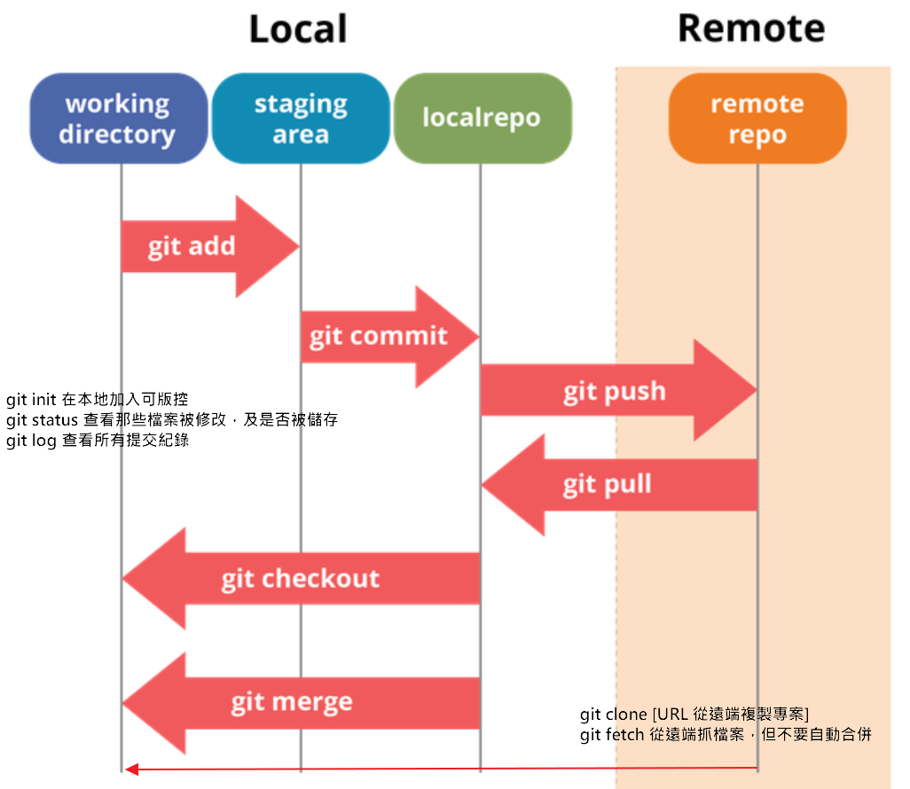

# 開發紀錄筆記

---
## 20260118

TODO: 
1. int, float, string的差異
2. 熟悉terminal各目錄執行
3. f-string用法

---
## 20260119

TODO: BMI運算並將結果存成list和dict 各一個程式

---
## 20260207

TODO: 
1. 到https://www.104.com.tw/網站 -> 找到五個區塊並逐一命名, 最少成印出文字+link(href)
    -> optimize hint: 能拆class/function | 能把區塊拆分更細 |
2. 存成txt檔案
    -> optimize hint: json格式的txt
---
## 20260209

TODO: 
1. 隱式等待與顯式等待 
2. 命名(可讀性) ex: text_1
3. debug "上市櫃"
4. **用迴圈嘗試**, 避免使用[0]這種
5. 修改json檔案的結構 hint: dict or list 
ex: 
  suit_job = {
    "適合你的好工作": {xxx}
  }
6. 抓元素可以嘗試用更清楚的 or 唯一值 or 不會變動的
7. 嘗試直接抓文字, 類似: text()="中高齡"

---
## 20260212

TODO: 
1. 正常版本會包含前面的code邏輯
2. 將第一版改為優化版
3. debug "上市櫃" (或換寫法)
4. (可讀性)
5. 物件建立方式
6. for迴圈盡量先少用一行用法 下方為sample
  `  data = {}
    for el in elements:
        `data[el.text] = el.get_attribute("href")
7. 單一職責 (思考功能拆分 盡量要單位小 **但不能過小**) 
8. DataSaver 還有什麼功能可以先預寫3個 裡面可以pass 有空的話寫簡單的內容
9. 嘗試不用XPATH抓 data-gtm-index 這些(可讀性)
10. 嘗試直接抓文字, 類似: text()="中高齡"

---
## 20260222

需記住:
1. 做這件事之前, 先思考再動作 e.g. 我可能會寫很多同個物件相似的功能, 先想個5min再決定如何分類or同class與否 (初學強迫自己)
2. 做題目前, 若不確定要先與他人確認想法是否正確

TODO:
1. **整理架構與呈現**
2. 整理內容
3. 確認hovers為何錯誤 
4. 嘗試讓自己debug更容易 (可加一些log判斷)
5. 試試看用debug mode
6. 嘗試log優化
7. 命名確認

---
## 20260222

想法:
1. 自己到底想做什麼事情, 想清楚對照程式

TODO:
1. 整理架構 + 架構圖 (當下與我說明) -> 分類規則與邏輯 & 思考未來 (maybe 3-5y不異動)
    - 列出三種 & 最後選擇的原因
    - 1.list 對應，需要另外建立一個清單檔去對照
    - 2.依照功能區分，課程 / 一般練習 / 爬蟲練習
    - 3.職責劃分，程式碼收在一起，其餘分開放 ( e.g. log、截圖、doc ...)
2. 命名要確認 (e.g. google / ai -> 是否為python(或PEP8) / coding共用命名方式 ...等等)
3. 命名: # 1. 建立實例 (這時會開啟第一個視窗) finder = drivers.ElementFinder() 
4. 出錯問題調整 data_manager.py (e.g. 送不是dict程式會直接中止)

**aditional**
1. 有空調整 data_manager相關(檢查自己所有程式): 使用方式&命名搭配

---
## 20260223

TODO:
1. folder層級修改 & Log/Screenshot相關檢查
2. .gitignore -> 自己查+實作
3. 熟悉git使用方法 -> 勿僅用git add . 嘗試各別檔案搭配觀看git status
4. REPO Structure修正 (README) 
5. alert 
    - 優化 輸入框 輸入文字 並印出
    - 嘗試不使用time sleep / 使他100%穩定
6. hover
    - 嘗試不使用time sleep / 使他100%穩定 -> 若把滑鼠移走
7. iframe
    - 命名可讀性修正
    - 使他100%穩定 / 保護他
8. shadow-root
    - 使他100%穩定 / 保護他
9. baha_post_list -> 可讀性  *已經有的命名(domain之類的)盡量使用相同的 e.g. gamer, vip*
10. 思考: data_manager 使用self.data的可能性 
11. 改成自己要的遊戲

---
## 20260228

**下課後, 自行留10min整理上課重點與消化**
**上課前, 整理好想討論的項目 or 困惑的項目**

1. [x] 寫之前確認是否有相同的邏輯 or 用法
2. [ ] 若沒有, 思考要怎麼樣設計 
3. [ ] 寫完確認 (任何情況都要 -> 上傳前、上傳完成) 
4. [ ] 最外層README調整 & 思考呈現方式
5. [ ] alert Refactoring (e.g 區塊 or 開關)
6. [x] debug -> basic_practice (except)
7. [x] hover -> 驗證是否合理
8. [x] shadow_root -> 是否有方式替代find_element
9. [x] 共用driver (設計裡面) 

---
## 20260302

1. 歷程管理 & 日期 -> 設計
2. 推導過程 e.g. -> 單一符合 -> 多個符合 -> 邊界符合 (edge) or 其他情境 -> 找到最適合的方式(能解決你大部分的問題)

---
## 20260305

1. [] AI使用: 一次對話不要過多, 若太多可以拆分, 或是清除視窗再問(拆分單元的概念) -> new session 避免hallucination
2. [] AI不一定必須使用json / markdown格式才會比較清楚, 是因為你在使用這些格式的時候, 腦袋已經先整理清楚了 #輸出json會比較好做後續應用
3. [X] "not found" -> 相容性 -> stg staging -staging
    "Not Found" -> PM規定的文字 -> 完全不能有誤差
------
1. [X] 確認路徑為何不能使用, (可額外嘗試讓各路徑都可以執行)
2. [X] 都改共用driver + 哪邊可抽成function (e.g. wait.until(EC.element_to_be_clickable))
3. [X] 減少重複code (e.g. driver.switch_to.default_content()) -> hint: 回到default狀態
4. [?] 確認 inner_p = wait.until(lambda _: root.find_element(By.CSS_SELECTOR, "slot"))

筆記 : 
1. PEP8 規範要弄熟
2. 要知道程式用法，e.g. lower >>> 不在意大小寫， '==' >>> 完整比對
3. 一個課程一個 PR

---
## 20260307

1. [?] 查一下 sys.path(.) 寫法，或是放一個共用路徑，一開始就 import 以及 os.path 的詳細寫法
2. [X] 命名重要性 visit 是動詞，如果單純用 visit_elem 會不懂意思，要用 visible 比較清楚
3. [X] function 要加上用法註解不然別人會看不懂
4. [X] wait.alert 與 wait.alert_switch 用法不完全貼切 (wait_and_switch) 可寫在 function 註解說明
5. [X] alert.py 程式中，若要新舊比對要思考一下怎麼紀錄，不然會很亂 (建議可以刪掉，PR 自己就會有紀錄了)
6. [?] get_url 抽 function (未來建議實作)
7. [X] hovers 的 avatar 意思是?
8. [?] iframe_switch 用意是? 嘗試不要寫三次 (except 那邊)，也要確保程式可繼續執行，需要切回來，不然後面的程式也會跟著死
9. [?] 以下 function 須重新設計，應該不是只有 default_content? 應保留可以切換其他視窗的方法比較好
    def iframe_switch(self):
        """切回主頁面 default content"""
        self.driver.switch_to.default_content()
10. [X]查一下 inner_p = finder.wait_elem(lambda _: root.find_element(By.CSS_SELECTOR, "slot"))
    _ >>> 的意思
    lambda 要同時 wait + find 動作
11. [X] drivers find_elem 要改一下，確認 *elem_tuple >>> 意思是? (跟下面只傳一個參數的用法牴觸 by_type)
12. [X] 調整 combination_practice 寫法 (抽共用)
13. [X] headless 用法

---
## 20260312

1. [X] alert.py 為什麼要這行 prompt_elem.click()，點了第 3 個 alert，又再次點一次 alert 並輸入
2. [?] hovers.py >>> 有時間再做，if view_profile_text.text == 'View profile':，這邊沒有 else 處理，也許是 print text 出來看抓錯成什麼 ?
3. [?] file_manager.py
    - 哪裡用到 self.data? sava 裡面已經有 data 了，或是單純處理 data function
    - LogHandler 弄懂這個 class 在幹嘛
    - 這個 class 內的各個 funciton 怎麼應用，畫架構圖
    - read_file 沒用到 ?
    - 目前寫法會變成要宣告 3 次 a_log = LogHandle()、b_log = LogHandle()、 c_log = LogHandle()，不方便

---
## 20260314

1. file_manager : 
    - num >>> 建議改成 line_num 或 rows_num ??? 
    - readlines 跟 readfile 類似
    - readlines 資料量過大 開不起來用這個
    - read file  資料量過大 會開不起來
    - read_all_lines 不要去建立預設檔
    - write_log 也不用給他預設值
    - def read_all_lines(self, file_path, num):> read_all_lines 不等於 讀取檔案指令行，要用 specified
2. 補充 : __init__ 可加可不加
3. class LogManager: 看熟這隻 (找時間看懂以下 log 產生方式)
4. data_managger: 
    - save_json 缺少註解，self.title 沒用到 ? filename 不貼切 ? data_manager 跟 file_manager 相近 ? ( 可用繼承或切開 )
    - 套入多種情境 > 有沒有符合，更好的方式，能不能擴充，合併 ? 未來調整可能性 ?
5. gitignore : logs/*.txt ，看要怎麼調整讓他忽略 log 不要上傳

---
## 20260319

1. file_manager 可以用副檔名方式去切 [0, -3] 來寫判斷式
    - if elif 寫就好
    - 當 class or function 太多可以切分
        e.g. class aaa
             class bbb
             class ccc
    - 試一下繼承檔案方式 super (file 細且小 , data 繼承 file 處理更細節)
2. log 檔不存在會有錯誤 (跑去 ignore 刪除了)
3. 綜合討論 > 15，從最上面文章標題開始抓，直到符合 > 15 標準，存標題，點進去那篇文章，把文章內容 (文字 + URL https://forum.gamer.com.tw/C.php?bsn=23805&snA=729803&tnum=14 ) 存下來，把所有留言的分頁掃完，抓 GP 最高的回覆內容印出來

---
## 20260322

1. 繼續調整 madhead_post_crawler_pro.py 的程式
    - 注意頁面網址
        - base_url = https://forum.gamer.com.tw/C.php?bsn=23805&snA=610529&tnum=23087
        - page 1 = https://forum.gamer.com.tw/C.php?bsn=23805&page=1&snA=610529&tnum=23087
        - page 2 = https://forum.gamer.com.tw/C.php?bsn=23805&page=2&snA=610529&tnum=23087
        - url = f"{base_url}&page={page}"
        - print(f"抓第 {page} 頁,url 是 = {url}")

---
## 20260324

1. [] 查一下 API 常用狀態碼
2. [] 看一下這個影片 https://www.youtube.com/watch?v=zvKadd9Cflc&t=1s
3. find_high_gp.py
    - [X] 為什麼有這個 ? if gp_text == "爆":  A: 目前在手機上看才有
    - [X] log.save_txt(file_path, page_best_content) 這個跟主程式的 log 重複了，儘量避免寫重複的
    - [X] 可以適當一下補一下 log，或 print 出這一行是抓什麼位置 ?
        - [] posts = self.wait.until(EC.presence_of_all_elements_located((By.CSS_SELECTOR, "section[id^='post_']")))
    - [?] 這個想一下要不要共用，儘量避免寫死 file_path = "side_projects/logs/madhead_log.txt" 
    - [X] 這個可以用繼承寫法  def __init__(self, driver):  
4. madhead_post_crawler_pro.py
    - [X] log 優化 (總log - 個別查)
    - [X] 寫一下為什麼用 -1 best_gp = -1
    - [X] 優化一下這段 if gp_text == "爆": ~~~ best_art_elem = title_elem
        - [X] 看一下這段有沒有更好的寫法 if gp_value > best_gp: 應該有另一種比大小的方法
    - [X] 這段測試的方法，可以把值改大測試，if gp_value > 15: (需要加上如果沒有 > 15 的怎辦?)
    - [X] 搞清楚為什麼要加 contiune ，應該可以不用 ? 因為如果錯誤的話，後面 log.save 都沒意義

---
## 20260327

1. [X] 清掉 github 舊的 (不要的) branch，請查出幾種方式
2. [X] 可以考慮用 copilt
3. [X] webcontroller 有寫了共用 function 但是外面沒有用到，需要優化 (主程式寫了很多重複的東西 line 19 - 31 )
4. [X] 看 path 能不能不要重複寫路徑 file_path、content_path 
5. [X] 查一下 404 跟網址的意思
    - 404 錯誤的核心訊息就是**「路徑對不上」**。不論是人為輸入錯誤、系統架構更動，還是程式邏輯漏洞，只要伺服器無法在預期位置找到對應的內容，就會回傳 404。
6. [X] 查一下 API GET、PATCH、DELETE、PUT、HEAD、OPTIONS、POST
7. [X] madhead_post_crawler_pro 的 if gp_text == "爆": gp_value = 100 改寫

---
## 20260329

1. madhead_post_crawler.py 
    - [X] 主程式，wait = WebDriverWait(driver_control, 10) 應該不需要
    - [X] 執行 python -XXX 兩種模式，執行 "爆" 的方式 :
        - 發一個爆
        - 全發爆
        - headless 執行
2. [?] github setting 可以看一下怎麼加入私人的權限
3. [X] github 看一下指令有哪些，可以畫圖，指出功能
        - 
4. [?] 可以結合 gemini 問答方式
5. API
    - [X] headers 可以查一下
    - [?] Beautifulsoup 可以玩一下，結合 API (requests)
    - [X] API User-Agent 一定要帶
    - [X] 打一下 get API 練習網址 (https://httpbin.org/)

## 20260402

1. 查一下 git 二級指令 restore、rebase、merge等 ...
2. madhead_post_crawler_pro.py 主程式 :
    - 整理一下 code + 註解
    - 用 f'string 處理 log 檔名，舉例 : print(f"side_projects/logs/{file_path}log.txt")
    - 查一下 argparse.ArgumentParser 有沒有相似的套件?
    - parser.add_argument("--headless", action="store_true")，action="store_true" 要怎麼使用，有沒有其他 action 可以用
    - args 加上可以帶參數、可縮寫的彈性用法
    - 當需帶入的參數變多時，如何增加可讀性 (line36)，driver_control = WebController(headless=args.headless)
3. find_high_gp.py :
    - 不要寫成兩個 function，用使用者傳入的值處理 (跑a邏輯或b邏輯)
        - 一併調整主程式的，修正 if 判斷式(結合find_high_gp.py 檔的function)
4. get API 查一下怎麼爬巴哈網站

