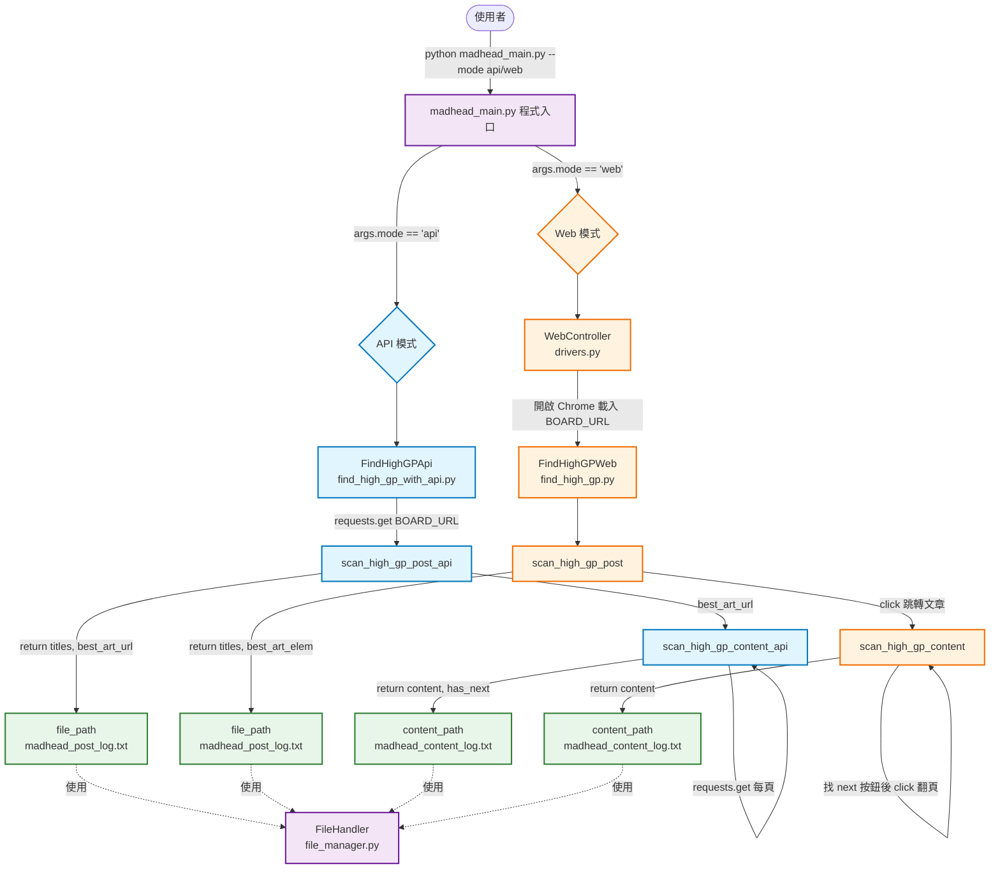

# 神魔之塔爬蟲 - 系統架構圖

## 整體架構



## 模組職責

| 模組 | 職責 |
|------|------|
| `madhead_main.py` | 程式入口；根據 `--mode` 參數切換 API / Web 模式 |
| `utils/find_high_gp_with_api.py` | API 模式：用 requests 抓 HTML，純字串解析 |
| `utils/find_high_gp.py` | Web 模式：用 Selenium 開瀏覽器互動 |
| `side_projects/utils/drivers.py` | Web 模式專用的 Chrome WebDriver 包裝 |
| `utils/file_manager.py` | 共用 log 寫入工具 |

## API 模式 vs Web 模式對照

| 項目 | API 模式 | Web 模式 |
|------|---------|---------|
| HTTP 請求 | `requests.get(url)` | Selenium 開 Chrome 載入 |
| 解析 HTML | 純字串 `split` / `find` | CSS selector + WebElement |
| 「點進文章」 | 拿 href → 換 URL 再 GET | `elem.click()` 真的點 |
| 翻頁 | 組 `&page={n}` URL 重新 GET | 找 `.next` 按鈕 click |
| 「下一頁」偵測 | 字串比對 `class="next"`/`'next'` | `find_elements(.next.no)` 數量 |
| 依賴 | 只需 `requests` | `selenium` + Chrome + driver |
| 執行成本 | 快、輕、可平行 | 慢、吃資源、會看到視窗 |
| JS 動態內容 | 抓不到 | 抓得到 |

## 執行方式

```bash
# API 模式（純 requests，不開瀏覽器）
python side_projects/madhead_main.py --mode api

# Web 模式（Selenium，會開 Chrome）
python side_projects/madhead_main.py --mode web
```

## 資料輸出

| Log 檔 | 內容 |
|--------|------|
| `side_projects/logs/madhead_post_log.txt` | 高 GP 文章標題清單 + 最高 GP 文章網址 |
| `side_projects/logs/madhead_content_log.txt` | 高 GP 回覆 + 爆文內文 |
